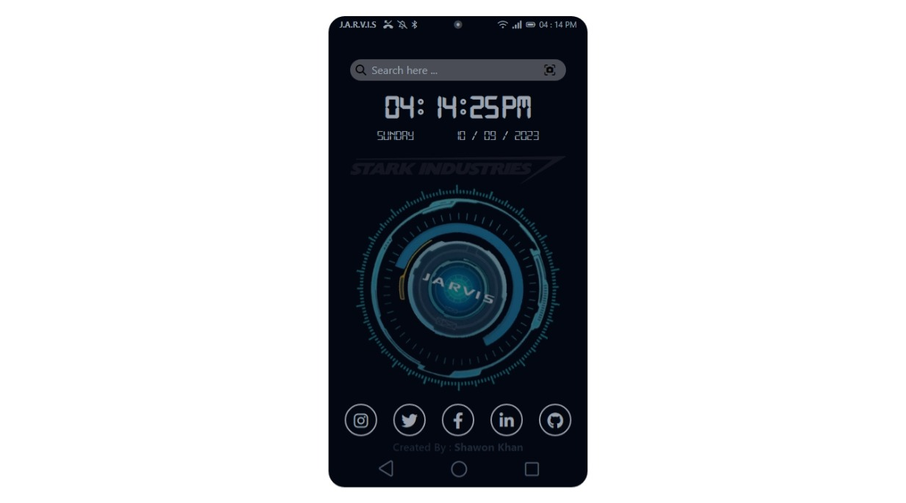

# JavaScript Digital Clock Wallpaper UI Design

"JS Clock Wallpaper" is a repository containing a mobile wallpaper digital clock UI design created using HTML5, CSS3, SCSS, JavaScript, and Tailwind CSS. The clock displays the time in a visually appealing way on a mobile device's wallpaper. Users can easily customize the clock's design and appearance with the provided code.

## Live Preview 

To preview this project please visit https://demo.shawon-khan.com/js-clock/

## User Interface

## Technologies Used
The following technologies have been used in the creation of this UI:

- **[Tailwind CSS](https://tailwindcss.com/)** : A utility-first CSS framework for creating responsive designs.ecosystem.
- **[FontAwesome](https://fontawesome.com/)**: A popular icon library that provides a wide range of icons for web projects.

## License

This project is licensed under the `GNU General Public License version 3.0 (GPL-3.0)`. You can find the full text of the license in the `LICENSE` file.

## Author

This UI is designed and maintained by **[Muhammad Nasir Uddin Khan Shawon](https://www.shawon-khan.com/)**. You can find more about me on my [GitHub profile](https://github.com/shawonk007). Feel free to reach out via email at `shawonk007@gmail.com` or connect with me on **[LinkedIn](https://www.linkedin.com/in/shawonkhan007)**.